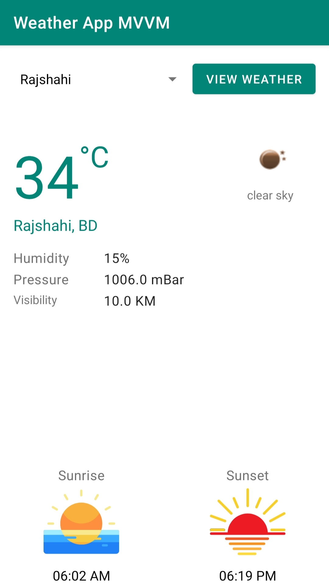

# Android Weather App Using Kotlin, MVVM & Retrofit2

An app to get information of several city’s weather using Kotlin, Retrofit2 and MVVM architecture. The UI will be as like as the screenshot below. There is a `Spinner` with some `City` name. After selecting a city, the user need to tap on the `View Weather` button. Then, this app will send request to the **Open Weather web API** and show the weather information in the UI.

<!---

-->
